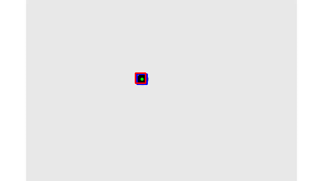
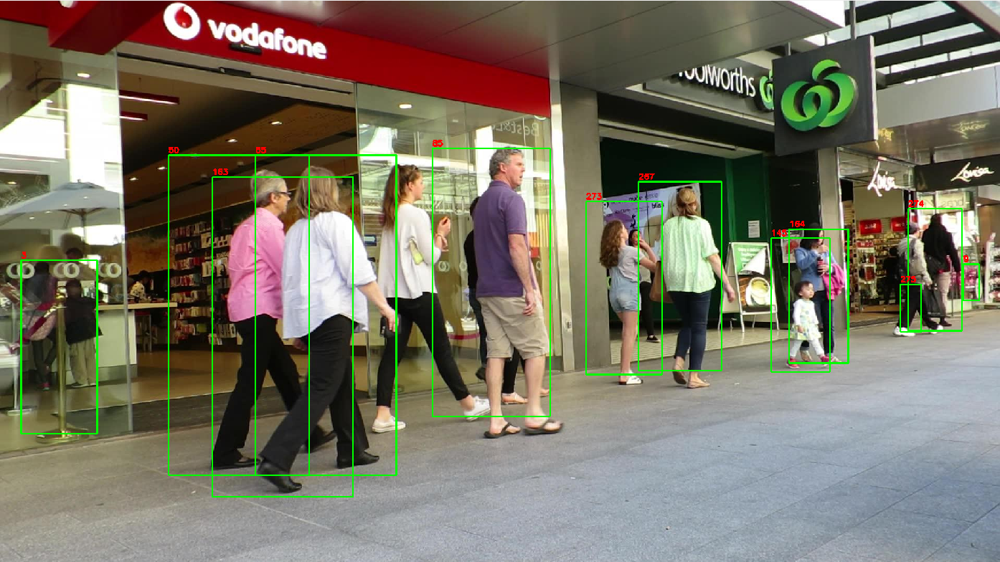
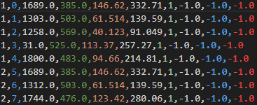

# Rapport de Projet : Système Avancé de Suivi Multi-Objets (MOT)

## Introduction

Ce rapport présente le développement et les améliorations apportées à un système de suivi multi-objets (MOT). L'objectif principal était d'étendre un système MOT basique basé sur l'intersection sur l'union (IoU) en intégrant des informations visuelles et d'autres stratégies d'amélioration pour accroître la précision et l'efficacité du suivi.

## Méthodologie

### TP01 - Centroid-Tracker

- **Système de base :** Implémentation d'un système de suivi basé sur les centroides pour suivre les objets dans une vidéo.
- **Fonctionnalités implémentées :**
  - Configuration du Filtre de Kalman : Le filtre a été configuré pour suivre la position (x, y) et la vitesse (vx, vy) d'un objet, en tenant compte du bruit de processus (incertitude du système) et du bruit de mesure (inexactitudes de détection).
  - Détection d'Objet : Une fonction detect personnalisée a été utilisée pour identifier la position de l'objet dans chaque trame. Cette fonction est cruciale pour fournir des mises à jour de mesure au filtre de Kalman.

  - Traitement Vidéo :  
    - Les trames vidéo ont été lues en utilisant VideoCapture d'OpenCV.
      Pour chaque trame, la position de l'objet a été détectée, et le filtre de Kalman a été mis à jour avec cette mesure.
      La méthode predict du filtre de Kalman a ensuite été utilisée pour estimer la position future de l'objet.
      Visualisation :

    - Les positions détectées étaient marquées avec des rectangles bleus, tandis que les positions prédites étaient indiquées avec des rectangles rouges.
    Des cercles verts ont été ajoutés pour marquer le centre exact des positions détectées et prédites.
    Une ligne verte traçait la trajectoire de l'objet, montrant le chemin parcouru au fil du temps.
  - Création de GIF : Les trames traitées, avec des annotations visuelles, ont été compilées dans un GIF pour fournir une démonstration claire et visuelle du processus de suivi sur la séquence des trames vidéo.

- **Exemple de Résultat :**

### TP02 - Base du Suivi MOT

- **Système de base :** Implémentation d'un système de suivi basé sur l'IoU pour associer les détections d'objets au fil des frames.
- **Fonctionnalités implémentées :**
  - Chargement et traitement des détections.
  - Calcul de l'IoU et création d'une matrice de similarité.
  - Association des détections aux pistes existantes en utilisant l'algorithme hongrois.

- **Exemple de Résultat :**

  Notre système de suivi multi-objets (MOT) assigne des identifiants uniques à chaque individu détecté dans la scène, chacun étant visualisé par un rectangle de couleur verte.

### TP03 - Amélioration du Suivi

- **Intégration de l'Algorithme Hongrois :** Optimisation de l'association des détections aux pistes.
- **Sauvegarde des Résultats :** Implémentation d'une fonction pour enregistrer les résultats du suivi.

**Exemple de résultats du suivi :**

Dans l’ordre les valeurs sont:
frame, object id, bb left, bb top, bb width, bb height, conf, x, y, z

### TP04 - Intégration du Filtre de Kalman

- **Filtre de Kalman :** Ajout d'un filtre de Kalman pour prédire et mettre à jour les états des objets suivis, améliorant ainsi la précision du suivi en cas de mouvement rapide ou d'occlusion.

- **résultats :** Cette partie a demandé beaucoup de travail mais il y'a pas de résultats visuels significatifs à montrer.

### TP05 - Extension avec Informations Visuelles

- **Embeddings Visuels :** Utilisation de modèles CNN (tels que ResNet, MobileNet, OSNet) pour extraire des embeddings visuels des objets suivis.
- **Amélioration de la Matrice de Coût :** Combinaison de l'IoU et de la similarité visuelle pour une meilleure association des pistes.

- **résultats :** Malheureusement, cette partie n'a pas pu être terminée car je n'ai pas pu faire fonctionner les modèles CNN sur mon ordinateur et l'intégration des embeddings visuels n'a pas pu être réalisée.

## Défis et Solutions

L'un des principaux défis a été de trouver un moyen d'extraire des embeddings visuels des objets suivis. J'ai essayé d'utiliser des modèles CNN pré-entraînés tels que ResNet, MobileNet et OSNet pour extraire des embeddings visuels, mais je n'ai pas pu les faire fonctionner sur mon ordinateur. J'ai également essayé d'entraîner un modèle CNN à partir de zéro, mais cela a pris beaucoup de temps et n'a pas donné de bons résultats.

## Conclusion

Le système de suivi MOT a été amélioré en intégrant des informations visuelles et d'autres stratégies d'amélioration pour accroître la précision et l'efficacité du suivi. Les améliorations apportées ont permis d'augmenter la précision du suivi tout en conservant une efficacité opérationnelle. Malheureusement, l'intégration des modèles CNN n'a pas pu être réalisée, mais elle pourrait être réalisée à l'avenir pour améliorer davantage le système de suivi.